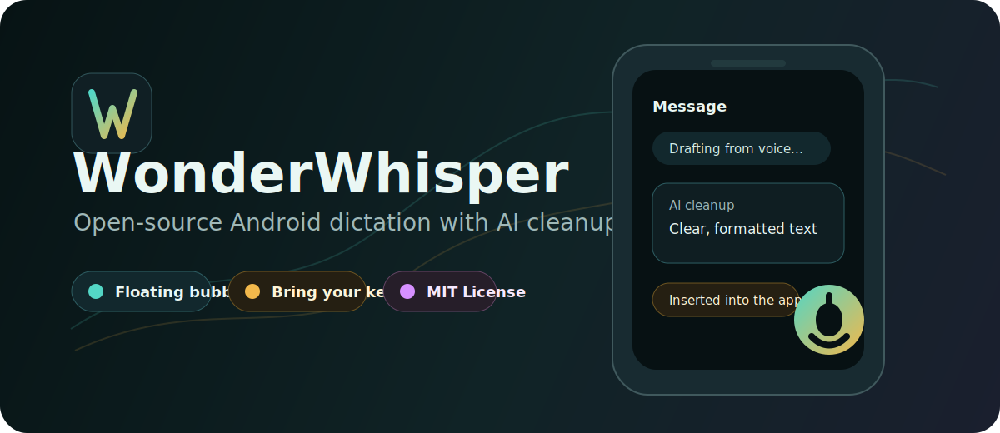
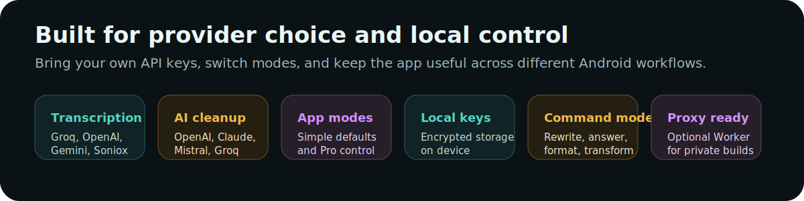
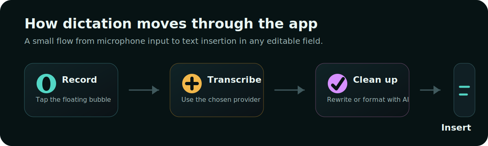

# WonderWhisper



WonderWhisper is an Android dictation app that brings a floating voice-to-text button to any text field. It combines cloud transcription providers, AI cleanup, command-mode editing, custom vocabulary, and accessibility-based text insertion so you can dictate into messaging apps, notes, email, browsers, and other Android apps.

This project is now open source under the MIT License. Bring your own API keys for cloud services.

## Features

- System-wide floating dictation bubble
- Accessibility-based text field detection and insertion
- Simple Mode with recommended defaults
- Pro Mode with model/provider selection
- Streaming and non-streaming transcription flows
- AI cleanup and post-processing after transcription
- Command Mode for editing, rewriting, answering questions, and transforming selected or copied text
- Custom vocabulary replacements
- Secure local API key storage with AndroidX Security Crypto
- Activity logs, audio file management, and debugging tools
- Optional Cloudflare Worker Groq proxy scaffold for private/self-hosted builds

## Supported Providers



Transcription providers include:

- Groq Whisper
- OpenAI Whisper / GPT-4o transcription
- Google Gemini
- ElevenLabs Scribe
- AssemblyAI
- Deepgram
- Mistral Voxtral
- Soniox streaming transcription

AI cleanup providers include:

- Groq
- OpenAI
- Anthropic Claude
- Mistral
- OpenRouter

Provider availability depends on the app settings, API keys, and current provider APIs.

## API Keys

WonderWhisper does not ship with public provider API keys. Cloud transcription and AI cleanup require user-provided API keys unless you build your own hosted proxy.

Add keys inside the app from **API Keys**. Useful starting points:

- [Groq Console](https://console.groq.com/keys)
- [OpenAI Platform](https://platform.openai.com)
- [Google AI Studio](https://aistudio.google.com/app/apikey)
- [ElevenLabs](https://elevenlabs.io)
- [AssemblyAI](https://www.assemblyai.com)
- [Deepgram](https://deepgram.com)
- [Mistral](https://mistral.ai)
- [OpenRouter](https://openrouter.ai)

Do not commit API keys, keystores, release artifacts, `.dev.vars`, `local.properties`, or Gradle properties containing secrets.

## How It Works



1. Enable the required Android permissions: microphone, overlay, notification, and accessibility service.
2. Tap the floating bubble to start recording.
3. Tap again to stop recording.
4. The selected transcription provider converts speech to text.
5. Optional AI cleanup rewrites or formats the text.
6. The accessibility service inserts the result into the active text field.

Command Mode activates when dictation starts with "command". It can rewrite selected text, use clipboard context, answer questions, or perform text transformations.

## Build From Source

Requirements:

- Android Studio
- JDK compatible with the Android Gradle Plugin
- Android SDK 35
- NDK 28.2.13676358

Build commands:

```bash
./gradlew assembleDebug
./gradlew testDebugUnitTest
./gradlew lint
```

Install on a connected device or emulator:

```bash
./gradlew installDebug
```

Local proxy configuration is optional and should stay local:

```properties
groq.proxy.baseUrl=
groq.proxy.appToken=
```

These values can live in `local.properties` or private Gradle properties. They are intentionally ignored by git.

## Project Structure

- `app/` - Android app module
- `app/src/main/java/com/slumdog88/dictationkeyboardai/` - app source
- `app/src/main/java/com/slumdog88/dictationkeyboardai/ui/screens/` - Compose screens
- `app/src/main/java/com/slumdog88/dictationkeyboardai/transcription/` - transcription flows
- `app/src/main/java/com/slumdog88/dictationkeyboardai/transcription/streaming/` - streaming dictation scaffolding
- `workers/groq-proxy/` - optional Cloudflare Worker proxy scaffold

## Privacy Notes

WonderWhisper is designed around local control:

- API keys are stored locally using encrypted storage.
- Local logs and audio files remain on the device unless you export or share them.
- Cloud providers receive audio/text only when you choose a cloud-backed transcription or AI model.
- Accessibility permissions are used to detect editable fields and insert text.

Always review provider terms and privacy policies before using third-party AI services.

## Contributing

Contributions are welcome. Please read [CONTRIBUTING.md](CONTRIBUTING.md) before opening a pull request.

Good first areas:

- Provider bug fixes
- Device compatibility fixes
- Accessibility reliability improvements
- Documentation
- Tests around settings, provider selection, and command-mode behavior

## Security

Please do not open public issues for sensitive security reports or leaked keys. See [SECURITY.md](SECURITY.md).

## License

WonderWhisper is released under the [MIT License](LICENSE).
