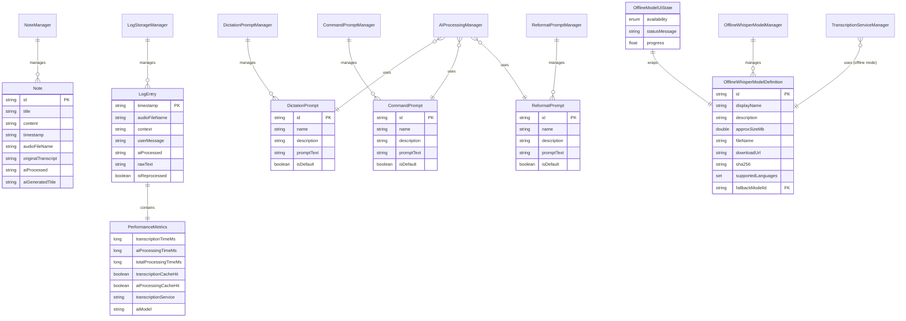

# DictationKeyboardAI - Data Model Documentation

> Keep this document up to date with any changes.

## Table of Contents
1. [Core Domain Models](#core-domain-models)
2. [Configuration Models](#configuration-models)
3. [Service Models](#service-models)
4. [UI State Models](#ui-state-models)
5. [Manager Layer](#manager-layer)
6. [Persistence Layer](#persistence-layer)
7. [Entity Relationships](#entity-relationships)

---

## Core Domain Models

### 1. Note
**Location**: `Note.kt`  
**Purpose**: Represents a voice note entry with transcription and AI processing

```kotlin
data class Note(
    val id: String = UUID.randomUUID().toString(),
    val title: String,
    val content: String,                    // Final processed content
    val timestamp: String,
    val audioFileName: String,
    val isRecording: Boolean = false,
    val originalTranscript: String? = null,  // Raw speech-to-text
    val aiProcessed: String? = null,         // AI-enhanced version
    val aiGeneratedTitle: String? = null     // AI-generated title
)
```

**Relationships**:
- Persisted as JSON under the SharedPreferences key `notepad_entries` (with `notepad_modified` for cache invalidation)
- `audioFileName` references an `.m4a` file written by `NotePadManager`/`AudioFileManager`
- Can have multiple versions: original transcript → AI processed
- Managed by `NoteManager`

---

### 2. LogEntry
**Location**: `LogEntry.kt`  
**Purpose**: Recording history entry for dictation sessions

```kotlin
data class LogEntry(
    val timestamp: String,
    val audioFileName: String?,
    val context: String?,
    val userMessage: String?,               // Raw transcription
    val aiProcessed: String?,                // AI-formatted output
    val rawText: String,                     // Complete raw log
    val isReprocessed: Boolean = false,
    val performanceMetrics: PerformanceMetrics = PerformanceMetrics.empty()
)
```

**Relationships**:
- Has one `PerformanceMetrics` object
- `audioFileName` holds the basename of the recorded audio stored on disk (if available)
- Stored as append-only segments in `filesDir/dictation_logs.txt` (delimiter `---\n`)
- Managed by `LogStorageManager`

---

### 3. PerformanceMetrics
**Location**: `PerformanceMetrics.kt`  
**Purpose**: Timing and performance tracking for dictation operations

```kotlin
data class PerformanceMetrics(
    val transcriptionTimeMs: Long = 0L,
    val aiProcessingTimeMs: Long = 0L,
    val totalProcessingTimeMs: Long = 0L,
    val transcriptionCacheHit: Boolean = false,
    val aiProcessingCacheHit: Boolean = false,
    val transcriptionService: String = "",
    val aiModel: String = ""
)
```

**Builder Pattern**: Uses `PerformanceMetricsBuilder` for construction and can be reconstructed from persisted logs via `PerformanceMetrics.fromLogEntry()`

**Relationships**:
- Embedded in `LogEntry`
- Tracks metrics for both transcription and AI processing stages

---

## Configuration Models

### 4. DictationPrompt
**Location**: `DictationPrompt.kt`  
**Purpose**: AI prompt templates for speech-to-text formatting

```kotlin
data class DictationPrompt(
    val id: String = UUID.randomUUID().toString(),
    val name: String,
    val description: String,
    val promptText: String,
    val isDefault: Boolean = false
)
```

**Default Prompts**:
- Dictation Fast (British)
- Dictation Fast (American)
- Dictation Accurate (British)
- Dictation Accurate (American)
- Legacy Default

**Relationships**:
- Managed by `DictationPromptManager`
- Stored in SharedPreferences as JSON under `user_dictation_prompts`
- Used by `AIProcessingManager` for text formatting

---

### 5. CommandPrompt
**Location**: `CommandPrompt.kt`  
**Purpose**: AI prompt templates for command execution

```kotlin
data class CommandPrompt(
    val id: String = UUID.randomUUID().toString(),
    val name: String,
    val description: String,
    val promptText: String,
    val isDefault: Boolean = false
)
```

**Default Prompts**:
- Default (primary command executor)
- Example prompts: Detailed Assistant, Creative Writer, Concise Executor

**Relationships**:
- Managed by `CommandPromptManager`
- Stored in SharedPreferences as JSON under `user_command_prompts`
- Used by `AIProcessingManager` for command processing

---

### 6. ReformatPrompt
**Location**: `ReformatPrompt.kt`  
**Purpose**: AI prompt templates for content reformatting

```kotlin
data class ReformatPrompt(
    val id: String = UUID.randomUUID().toString(),
    val name: String,
    val description: String,
    val promptText: String,
    val isDefault: Boolean = false
)
```

**Default Prompts**:
- Auto-Detect (context-aware formatting)
- Meeting Notes
- Simple Reformat
- Brainstorm Organizer
- Professional Email
- Todo List
- Executive Summary
- Step-by-Step Guide

**Relationships**:
- Managed by `ReformatPromptManager`
- Persisted alongside other prompts (JSON) when user-defined
- Used for automatic note processing and content transformation

### 11. Keyboard Persistence
**Location**: `ui/keyboard/KeyboardViewModel.kt` (managed via `SharedPreferences`)
**Purpose**: Persisted state for the IME keyboard
- `last_transcription`: Caches the most recent dictation result for "Paste Last" feature.
- `keyboard_show_number_row`: Boolean toggle for number row visibility.
- `keyboard_layout_name`: Name of the active keyboard layout.
- `enable_postprocess`: Toggle for AI post-processing.

---

## Service Models

### 7. OfflineWhisperModelDefinition
**Location**: `offline/OfflineWhisperModels.kt`  
**Purpose**: Metadata for offline Whisper models

```kotlin
data class OfflineWhisperModelDefinition(
    val id: String,
    val displayName: String,
    val description: String,
    val approxSizeMb: Double,
    val fileName: String,
    val downloadUrl: String,
    val sha256: String,
    val supportedLanguages: Set<String>,
    val fallbackModelId: String? = null,
    val suppressNonSpeechTokens: Boolean = true
)
```

**Available Models**:
- Tiny (English, 39 MB) - q8 quantization
- Base (English, 74 MB) - q8 quantization
- Base (Multilingual, 146 MB) - q8 quantization, supports 98 languages

**Relationships**:
- Managed via the registry pattern in `OfflineWhisperModelRegistry`
- Used by offline transcription service

---

### 8. OfflineModelUiState
**Location**: `offline/OfflineWhisperModels.kt`  
**Purpose**: UI state for offline model downloads

```kotlin
data class OfflineModelUiState(
    val definition: OfflineWhisperModelDefinition,
    val availability: OfflineModelAvailability,
    val statusMessage: String? = null,
    val progress: Float? = null
)

enum class OfflineModelAvailability {
    UNKNOWN, READY, DOWNLOADING, MISSING, ERROR
}
```

---

## UI State Models

### 9. CustomLanguageConfig
**Location**: `utils/SettingsManager.kt`  
**Purpose**: Language customization configuration

```kotlin
data class CustomLanguageConfig(
    val vocabularyItems: List<String>,
    val spellingPairs: List<Pair<String, String>>,
    val replacementRules: List<TextProcessingUtils.ReplacementRule>
)
```

**Relationships**:
- Cached in `SettingsManager`
- Used for vocabulary correction during transcription

---

### 10. CachedResponse
**Location**: `ai/AIProcessingManager.kt`  
**Purpose**: AI response caching to avoid repeated API calls

```kotlin
private data class CachedResponse(
    val result: String,
    val timestamp: Long,
    val ttl: Long = 300_000 // 5 minutes TTL
)
```

**Cache Implementation**:
- LRU cache with max 100 entries
- 5-minute TTL
- Automatic eviction of old entries

---

## Manager Layer

### Manager Classes Architecture

```
┌─────────────────────────────────────────────────────────────┐
│                    Application Layer                         │
├─────────────────────────────────────────────────────────────┤
│  Activities / Compose Screens                                │
└────────────────────┬────────────────────────────────────────┘
                     │
      ┌──────────────┴──────────────┐
      │                              │
┌─────▼──────────┐         ┌────────▼─────────┐
│ SettingsManager│         │ ServiceManager   │
│ (Context)      │         │ (Permissions)    │
└────────┬───────┘         └──────────────────┘
         │
    ┌────┴─────────────────────────────────────┐
    │                                           │
┌───▼──────────────┐                  ┌────────▼──────────┐
│ AIProcessingMgr  │                  │ TranscriptionMgr  │
│ (LLM/Prompts)    │                  │ (Speech-to-Text)  │
└──────┬───────────┘                  └────────┬──────────┘
       │                                       │
  ┌────┴────────────┐              ┌──────────┴──────────┐
  │                 │              │                      │
┌─▼───────────┐  ┌──▼────────┐  ┌─▼──────────┐  ┌───────▼──────┐
│DictationPrmpt│  │CommandPrmpt│  │NetworkMgr  │  │OfflineWhisper│
│Manager       │  │Manager     │  │(OkHttp)    │  │ModelManager  │
└──────────────┘  └────────────┘  └────────────┘  └──────────────┘
```

### Key Manager Responsibilities

#### SettingsManager
- Manages app settings and preferences
- Simple/Pro mode switching
- Provides settings with mode-based overrides
- Caches language configuration

#### DictationPromptManager
- CRUD operations for dictation prompts
- Default + user-created prompt management
- Migration of old prompts
- Validation and naming rules

#### CommandPromptManager
- CRUD operations for command prompts
- Default + user-created prompt management
- Migration of old prompts
- Validation and naming rules

#### ReformatPromptManager
- CRUD operations for reformat prompts
- Default + user-created prompt management
- Provides prompts for note transformation

#### AIProcessingManager
- Orchestrates AI processing pipeline
- Response caching (5-min TTL, 100-entry LRU)
- Provider selection (OpenRouter, Groq, etc.)
- Context management (screen, vocabulary, selected text)
- Performance metrics tracking

#### TranscriptionServiceManager
- Manages transcription service selection
- Supports: Groq Whisper, Offline Whisper, Deepgram
- Caching layer for transcriptions
- Performance tracking

#### OfflineWhisperModelManager
- Model download and installation
- SHA256 verification
- Storage management
- Model availability tracking

#### LogStorageManager
- Persistent storage of recording history
- Audio file management
- Log entry CRUD operations
- Performance metrics storage

#### NoteManager / NotePadManager
- Voice note management
- Audio recording coordination
- AI title generation
- Note versioning (original → processed)

#### AudioManager / AudioFileManager
- Audio recording coordination
- File storage and cleanup
- Format conversion
- Audio playback

#### StatisticsManager
- Usage statistics tracking
- Performance analytics
- User behavior metrics

---

## Persistence Layer

### Storage Mechanisms

The runtime data is persisted through lightweight stores rather than a relational database. Core domain objects (notes, prompts, settings) are serialised to JSON in SharedPreferences, while histories and audio assets live on disk alongside in-memory caches for hot data.

```
┌──────────────────────────────────────────────────────┐
│              Persistence Layer                        │
├──────────────────────────────────────────────────────┤
│                                                       │
│  ┌────────────────┐    ┌─────────────────────┐     │
│  │ SharedPreferences│    │ File System         │     │
│  ├────────────────┤    ├─────────────────────┤     │
│  │ app_settings   │    │ Audio Files (.wav)  │     │
│  │ app_prefs      │    │ Model Files (.bin)  │     │
│  │ api_keys       │    │ Log Files (.txt)    │     │
│  └────────────────┘    └─────────────────────┘     │
│                                                       │
│  ┌────────────────────────────────────────────┐     │
│  │ In-Memory Caches                           │     │
│  ├────────────────────────────────────────────┤     │
│  │ AI Response Cache (LRU, 5-min TTL)        │     │
│  │ Transcription Cache                        │     │
│  │ Language Config Cache                      │     │
│  └────────────────────────────────────────────┘     │
└──────────────────────────────────────────────────────┘
```

### SharedPreferences Keys

**app_settings**:
- `user_dictation_prompts` / `user_command_prompts` - JSON arrays of Prompt objects
- `selected_dictation_prompt_id` / `selected_command_prompt_id` - Current prompt selection
- `transcription_service` / `offline_whisper_model_id` - Active transcription provider configuration
- `ai_model` / `openrouter_model_id` / `notepad_ai_model` - Model routing metadata
- `enable_postprocess`, `include_screen_context`, `enable_paragraphs` - Feature toggles
- `custom_vocabulary`, `custom_spelling` - Custom language resources
- `command_word`, `audio_files`, `english_variant`, `simple_dictation_mode` - Misc. feature state
- `notepad_entries`, `notepad_modified` - Cached Note list state
- Migration flags such as `dictation_prompts_migration_v2_complete`

**app_prefs**:
- `is_simple_mode` - Simple/Pro mode flag
- Other UI prefs scoped to simple mode (e.g., onboarding state)

**Encrypted Storage** (via `SecureApiKeyManager`):
- API keys for various providers
- Stored using AndroidX Security Crypto

### File System Storage

**Audio Files**:
- Location: App-specific storage (temporary) then Downloads/`WonderWhisper` public directory
- Formats: `.m4a` (AAC, 44.1 kHz mono) via `MediaRecorder`; `.wav` when offline PCM recorder is used
- Managed by: `AudioFileManager` (creation/migration/cleanup)
- Lifecycle: Tied to `LogEntry` or `Note` via string filename references

**Model Files**:
- Location: App-specific storage
- Format: GGML binary (.bin)
- Verification: SHA256 checksums
- Managed by: `OfflineWhisperModelManager`

**Log Files**:
- Location: App-specific storage (`filesDir/dictation_logs.txt`)
- Format: Plain text, entries separated by `---\n`
- Content: Raw log blob, transcription/AI text, context metadata, performance metrics
- Managed by: `LogStorageManager`

---

## Entity Relationships

### Complete Entity Relationship Diagram



### Data Flow Diagram

```
┌─────────────────────────────────────────────────────────────┐
│                    User Input Layer                          │
└────────────────────┬────────────────────────────────────────┘
                     │ Voice Input
                     ▼
┌─────────────────────────────────────────────────────────────┐
│              Audio Recording & Processing                    │
│  ┌──────────────┐  ┌────────────────┐  ┌─────────────────┐ │
│  │ AudioManager │→│ VAD Detection  │→│ Audio Buffer    │ │
│  └──────────────┘  └────────────────┘  └─────────────────┘ │
└────────────────────┬────────────────────────────────────────┘
                     │ Audio Data
                     ▼
┌─────────────────────────────────────────────────────────────┐
│           Transcription Layer                                │
│  ┌──────────────────────────────────────────────────────┐  │
│  │ TranscriptionServiceManager                           │  │
│  ├──────────────────────────────────────────────────────┤  │
│  │ • Groq Whisper v3 Turbo (API)                        │  │
│  │ • Offline Whisper (On-Device)                        │  │
│  │ • Deepgram Nova 2 (API)                              │  │
│  └──────────────────┬───────────────────────────────────┘  │
└─────────────────────┼───────────────────────────────────────┘
                      │ Raw Transcription
                      ▼
┌─────────────────────────────────────────────────────────────┐
│              AI Processing Layer                             │
│  ┌──────────────────────────────────────────────────────┐  │
│  │ AIProcessingManager                                   │  │
│  ├──────────────────────────────────────────────────────┤  │
│  │ Context Assembly:                                     │  │
│  │  • Vocabulary (Custom + Screen)                       │  │
│  │  • Screen Contents (Accessibility)                    │  │
│  │  • Selected Text                                      │  │
│  │  • Active Application                                 │  │
│  ├──────────────────────────────────────────────────────┤  │
│  │ Prompt Selection:                                     │  │
│  │  • DictationPrompt (formatting)                       │  │
│  │  • CommandPrompt (execution)                          │  │
│  │  • ReformatPrompt (transformation)                    │  │
│  ├──────────────────────────────────────────────────────┤  │
│  │ LLM Providers:                                        │  │
│  │  • OpenRouter (Claude, GPT, etc.)                     │  │
│  │  • Groq (LLaMA models)                                │  │
│  │  • Custom endpoints                                   │  │
│  └──────────────────┬───────────────────────────────────┘  │
└─────────────────────┼───────────────────────────────────────┘
                      │ Formatted Text
                      ▼
┌─────────────────────────────────────────────────────────────┐
│              Storage & Output Layer                          │
│  ┌──────────────────┐  ┌─────────────────┐                 │
│  │ LogStorageManager│  │ NoteManager     │                 │
│  │ (History)        │  │ (Voice Notes)   │                 │
│  └──────────────────┘  └─────────────────┘                 │
│  ┌──────────────────────────────────────────────────────┐  │
│  │ Output Destinations:                                  │  │
│  │  • Clipboard (IME)                                    │  │
│  │  • Direct Text Injection (Accessibility)              │  │
│  │  • Notepad                                            │  │
│  │  • External Apps                                      │  │
│  └──────────────────────────────────────────────────────┘  │
└─────────────────────────────────────────────────────────────┘
```

### Prompt Hierarchy

```
Prompt Types
├── DictationPrompt (Speech-to-Text Formatting)
│   ├── Default Prompts (4)
│   │   ├── Dictation Fast (British)
│   │   ├── Dictation Fast (American)
│   │   ├── Dictation Accurate (British)
│   │   └── Dictation Accurate (American)
│   └── User-Created Prompts (*)
│
├── CommandPrompt (Command Execution)
│   ├── Default Prompt (1)
│   │   └── Default Command Mode
│   └── User-Created Prompts (*)
│
└── ReformatPrompt (Content Transformation)
    ├── Default Prompts (8)
    │   ├── Auto-Detect
    │   ├── Meeting Notes
    │   ├── Simple Reformat
    │   ├── Brainstorm Organizer
    │   ├── Professional Email
    │   ├── Todo List
    │   ├── Executive Summary
    │   └── Step-by-Step Guide
    └── User-Created Prompts (*)
```

---

## Model State Transitions

### Note Lifecycle

```
┌─────────────┐
│   CREATED   │
│ (Recording) │
└──────┬──────┘
       │
       │ Stop Recording
       ▼
┌─────────────┐
│  TRANSCRIBED│
│ (Raw Text)  │
└──────┬──────┘
       │
       │ AI Processing (Optional)
       ▼
┌─────────────┐
│  PROCESSED  │
│(Formatted)  │
└──────┬──────┘
       │
       │ AI Title Generation (Optional)
       ▼
┌─────────────┐
│   FINAL     │
│ (Complete)  │
└─────────────┘
```

### Offline Model Lifecycle

```
┌─────────────┐
│   UNKNOWN   │
└──────┬──────┘
       │
       │ Check Availability
       ▼
┌─────────────┐     ┌─────────────┐
│   MISSING   │────→│ DOWNLOADING │
└─────────────┘     └──────┬──────┘
                           │
                           │ Download Complete
                           ▼
                    ┌─────────────┐
                    │   READY     │
                    └─────────────┘
                           │
                           │ Download Failed
                           ▼
                    ┌─────────────┐
                    │    ERROR    │
                    └─────────────┘
```

---

## Database Schema Summary

### Logical Schema (JSON in SharedPreferences)

**Prompts**
- Key: `user_dictation_prompts`
- Value: JSON Array of `DictationPrompt`
- Index: By `id`, searchable by `name`

**User Settings**
- Key: Various setting keys
- Value: String, Boolean, Int
- Simple/Pro mode determines effective values

**API Keys**
- Encrypted storage
- Key-value pairs by provider name

### File-Based Storage

**Audio Files**
- Pattern: `audio_<timestamp>.wav`
- Linked to: `Note.audioFileName`, `LogEntry.audioFileName`

**Model Files**
- Pattern: `<model_id>.bin`
- Verified: SHA256 checksum
- Linked to: `OfflineWhisperModelDefinition.fileName`

**Log Files**
- Pattern: `log_<timestamp>.txt`
- Contains: Structured text with metadata

---

## Performance Considerations

### Caching Strategy

1. **AI Response Cache**
   - Type: LRU Cache
   - Size: 100 entries
   - TTL: 5 minutes
   - Key: Hash of (transcript + prompt + context)

2. **Transcription Cache**
   - Type: Map<AudioHash, TranscriptionResult>
   - Purpose: Avoid re-transcribing same audio
   - Tracked in: `PerformanceMetrics.transcriptionCacheHit`

3. **Language Config Cache**
   - Type: In-memory cached object
   - Invalidation: On vocabulary changes
   - Thread-safe: Synchronized access

### Data Size Estimates

| Entity | Avg Size | Max Count | Total Storage |
|--------|----------|-----------|---------------|
| Note | ~2 KB | 1000 | ~2 MB |
| LogEntry | ~1 KB | 10000 | ~10 MB |
| Audio File | ~1 MB | 1000 | ~1 GB |
| Model File | 39-146 MB | 3 | ~260 MB |
| Prompts | ~5 KB | 50 | ~250 KB |

---

## Data Migration Strategy

### Prompt Migration (v2)

The app includes automatic migration for prompts:

1. **DictationPromptManager** checks `dictation_prompts_migration_v2_complete`
2. If not complete:
   - Converts old default prompts to user examples
   - Adds new default prompts
   - Marks migration complete
3. Similar process for `CommandPromptManager`

### Settings Migration

- Simple mode overrides settings dynamically
- No destructive changes to stored preferences
- Pro mode retains all user settings

---

## API Integration Models

### Transcription Services

```kotlin
// Service selection by name
transcriptionService: String
  ├── "Groq Whisper v3 Turbo"
  ├── "Offline Whisper (On-Device)"
  └── "Deepgram Nova 2"
```

### AI Processing Services

```kotlin
// Model selection by ID
aiModel: String
  ├── OpenRouter: "anthropic/claude-3.5-sonnet"
  ├── Groq: "meta-llama/llama-4-scout-17b-16e-instruct"
  └── Custom endpoints
```

---

## Security & Privacy

### Sensitive Data Handling

1. **API Keys**
   - Storage: AndroidX Security Crypto (EncryptedSharedPreferences)
   - Manager: `SecureApiKeyManager`
   - Never logged or cached

2. **Audio Files**
   - Storage: App-specific private storage
   - No external access without explicit user action
   - Cleaned up with note/log deletion

3. **Screen Context**
   - Captured via Accessibility Service
   - Used only during active recording session
   - Not persisted unless part of log entry
   - User toggle: `include_screen_context`

### Privacy Considerations

- **Offline Mode**: All processing on-device, no network calls
- **Simple Mode**: Uses fallback API keys (privacy-focused)
- **Pro Mode**: User provides own API keys
- **History**: Optional, can be disabled
- **Audio Retention**: User controls via settings

---

## Future Extensions

### Potential Schema Additions

1. **Tags System**
   ```kotlin
   data class Tag(
       val id: String,
       val name: String,
       val color: String
   )
   // Many-to-Many: Note ↔ Tag
   ```

2. **Folders/Categories**
   ```kotlin
   data class Folder(
       val id: String,
       val name: String,
       val parentId: String?
   )
   // One-to-Many: Folder → Note
   ```

3. **Sync Metadata**
   ```kotlin
   data class SyncState(
       val entityId: String,
       val entityType: String,
       val lastSyncTimestamp: Long,
       val syncStatus: SyncStatus
   )
   ```

4. **Usage Analytics**
   ```kotlin
   data class UsageStats(
       val date: LocalDate,
       val recordingCount: Int,
       val totalDurationMs: Long,
       val transcriptionService: String,
       val aiModel: String
   )
   ```

---

## Conclusion

This data model provides:
- **Separation of concerns**: Domain models, service models, UI state
- **Flexibility**: User-customizable prompts, multiple service providers
- **Performance**: Multi-layer caching, optimized storage
- **Privacy**: Encrypted keys, optional history, offline mode
- **Extensibility**: Clear manager layer, plugin-like architecture for prompts

The architecture supports both Simple (consumer-friendly) and Pro (power-user) modes while maintaining data integrity and performance.
